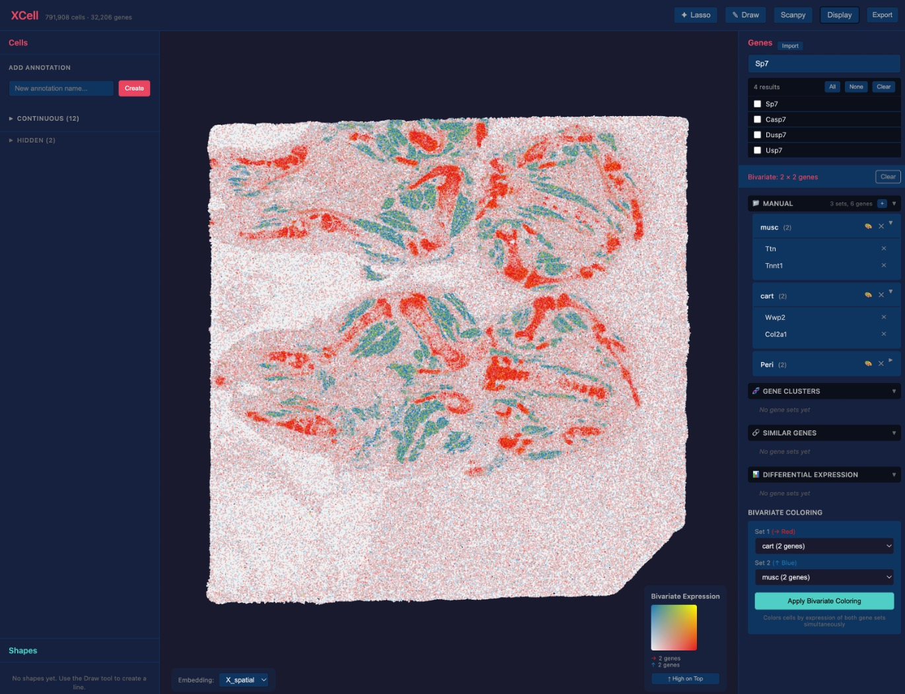

# XCell

Interactive web application for exploring and analyzing scRNA-seq and spatial transcriptomics data. Load an h5ad file, visualize cells on a scatter plot, run Scanpy analysis pipelines, and explore results — all from your browser.

    

## Quick Start

### Prerequisites

- Python 3.9+
- Node.js 18+

### Backend Setup

```bash
cd xcell/backend

# Create virtual environment (recommended)
python -m venv venv
source venv/bin/activate  # On Windows: venv\Scripts\activate

# Install in editable mode
pip install -e .
```

### Frontend Setup

```bash
cd xcell/frontend
npm install
```

### Launch

```bash
# Terminal 1: Start the backend (from xcell/backend/)
uvicorn xcell.main:app --reload

# Terminal 2: Start the frontend (from xcell/frontend/)
npm run dev
```

Open http://localhost:5173 in your browser.

A bundled toy dataset (`toy_spatial.h5ad`) loads automatically if no data path is specified. To load your own data, set the `XCELL_DATA_PATH` environment variable:

```bash
XCELL_DATA_PATH=/path/to/your/data.h5ad uvicorn xcell.main:app --reload
```

## Getting Started with Toy Data

The included `test_data/toy_spatial.h5ad` dataset is a small spatial transcriptomics dataset for exploring XCell's features. Here's a step-by-step walkthrough:

### 1. Explore the Scatter Plot

- Pan by clicking and dragging
- Zoom with scroll wheel
- Cells are rendered as points at their spatial coordinates

### 2. Color by Metadata

- Open **Cell Manager** (left panel)
- Select a metadata column to color cells by that annotation

### 3. Select Cells

- Use the **lasso tool** to draw a selection around cells
- Selected cells can be masked or deleted

### 4. Run Preprocessing

- Open the **Scanpy** modal (top toolbar)
- Go to **Preprocessing** and run in order:
  1. **Normalize Total** — normalize counts per cell
  2. **Log1p** — log-transform the data
  3. **Highly Variable Genes** — identify informative genes

### 5. Run Cell Analysis

- In the **Scanpy** modal, go to **Cell Analysis** and run in order:
  1. **PCA** — reduce dimensionality
  2. **Neighbors** — build cell neighborhood graph (requires PCA)
  3. **UMAP** — compute 2D embedding (requires Neighbors)
  4. **Leiden** — cluster cells (requires Neighbors)

### 6. View Clustering Results

- In **Cell Manager**, select the `leiden` column to color by cluster
- Switch the embedding to `X_umap` to see the UMAP layout

### 7. Color by Gene Expression

- Open **Gene Manager** (right panel)
- Search or browse genes
- Click a gene to color cells by its expression

### 8. Gene Sets

- Create gene sets manually in Gene Manager
- Import gene lists from files

### 9. Compare Cell Groups

- Expand a categorical column in the **Cell Manager** (left panel)
- Check the boxes next to the categories you want to compare
- Click the **Compare** button in the toolbar:
  - **2 checked** → pairwise differential expression
  - **3+ checked** → one-vs-rest marker gene analysis
- You can also use lasso selection: select cells → **Set as Group 1** / **Set as Group 2** → click **Compare** in the comparison bar

### 10. Trajectory Analysis

- Draw lines on the scatter plot
- Use the **Line Association** tool to analyze genes along trajectories

### 11. Run Gene Analysis

- In the **Scanpy** modal, go to **Gene Analysis**:
  1. **Build Gene Graph** — compute gene-gene similarity
  2. **Cluster Genes** — group genes by expression pattern

### 12. Spatial Contouring

- Select genes in the **Gene Panel** (click individual genes or use a gene set)
- Open the **Scanpy** modal, go to **Spatial Analysis** > **Contourize**
- Adjust smoothing sigma, contour levels, and grid resolution as needed
- Click **Run** — a new categorical column appears in the Cell Panel
- Color cells by the contour column to visualize spatial expression zones

### 13. Export Results

- Click **Export** in the toolbar to download annotations and results

## Features

- **Interactive scatter plot** — deck.gl-powered visualization with pan, zoom, lasso selection
- **Cell Manager** — browse/color by metadata, mask/delete cells
- **Gene Manager** — search genes, create gene sets, import gene lists
- **Scanpy integration** — run preprocessing, cell analysis (PCA, Neighbors, UMAP, Leiden), gene analysis, spatial analysis (contourize), and differential expression directly in the browser
- **Trajectory analysis** — draw lines and associate genes with spatial trajectories
- **Display settings** — adjust point size, opacity, colormaps, bivariate coloring
- **Export** — download annotations and analysis results

## Project Structure

```
xcell/
├── backend/
│   ├── xcell/
│   │   ├── main.py          # FastAPI app entry point
│   │   ├── adaptor.py       # DataAdaptor class (wraps AnnData)
│   │   ├── diffexp.py       # Differential expression
│   │   ├── data/
│   │   │   └── toy_spatial.h5ad  # Bundled toy dataset
│   │   └── api/
│   │       └── routes.py    # REST API endpoints
│   └── pyproject.toml       # Python dependencies
├── frontend/
│   ├── src/
│   │   ├── App.tsx           # Main app component
│   │   ├── store.ts          # Zustand state management
│   │   ├── main.tsx          # Entry point
│   │   ├── components/
│   │   │   ├── ScatterPlot.tsx        # deck.gl scatter plot
│   │   │   ├── CellPanel.tsx          # Cell metadata manager
│   │   │   ├── GenePanel.tsx          # Gene browser / gene sets
│   │   │   ├── ScanpyModal.tsx        # Scanpy analysis pipeline UI
│   │   │   ├── DiffExpModal.tsx       # Differential expression
│   │   │   ├── LineAssociationModal.tsx # Trajectory analysis
│   │   │   ├── DisplaySettings.tsx    # Visualization settings
│   │   │   ├── ShapeManager.tsx       # Shape/selection tools
│   │   │   └── ImportModal.tsx        # Gene list import
│   │   └── hooks/
│   │       └── useData.ts    # Data fetching hooks
│   ├── package.json          # Node dependencies
│   └── vite.config.ts        # Vite configuration
├── README.md
test_data/
├── toy_spatial.h5ad          # Toy dataset for testing
└── generate_toy.py           # Script to regenerate toy data
```

## Architecture

- **Backend**: FastAPI + AnnData + Scanpy, serving data and running analysis via REST API
- **Frontend**: React + TypeScript + Vite + deck.gl + Zustand for state management
- **Data flow**: h5ad file → DataAdaptor → REST API → React hooks → deck.gl visualization
- **API docs**: Available at http://localhost:8000/docs when the backend is running
